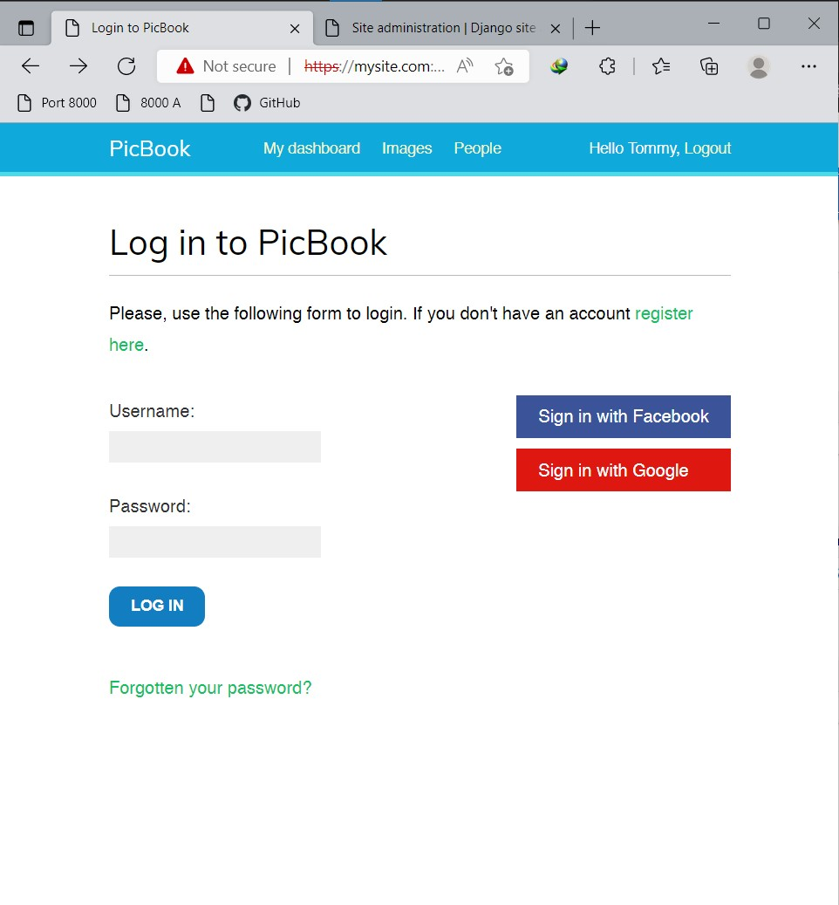
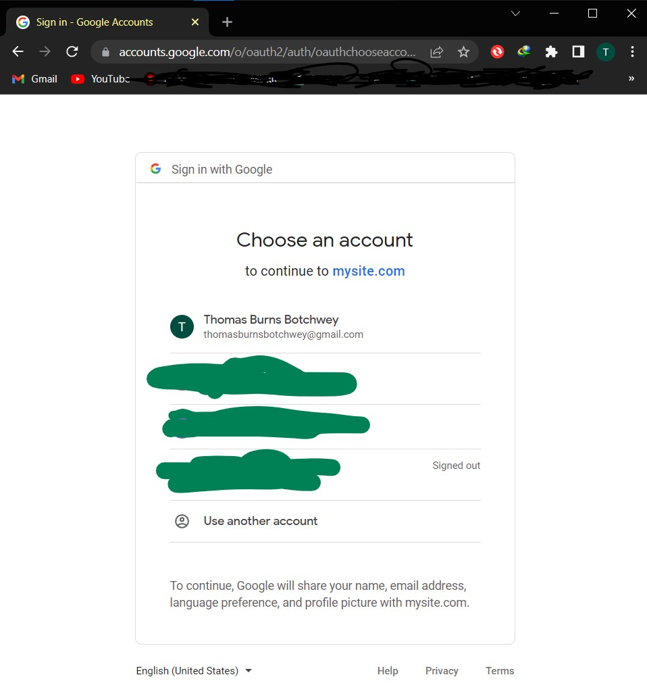
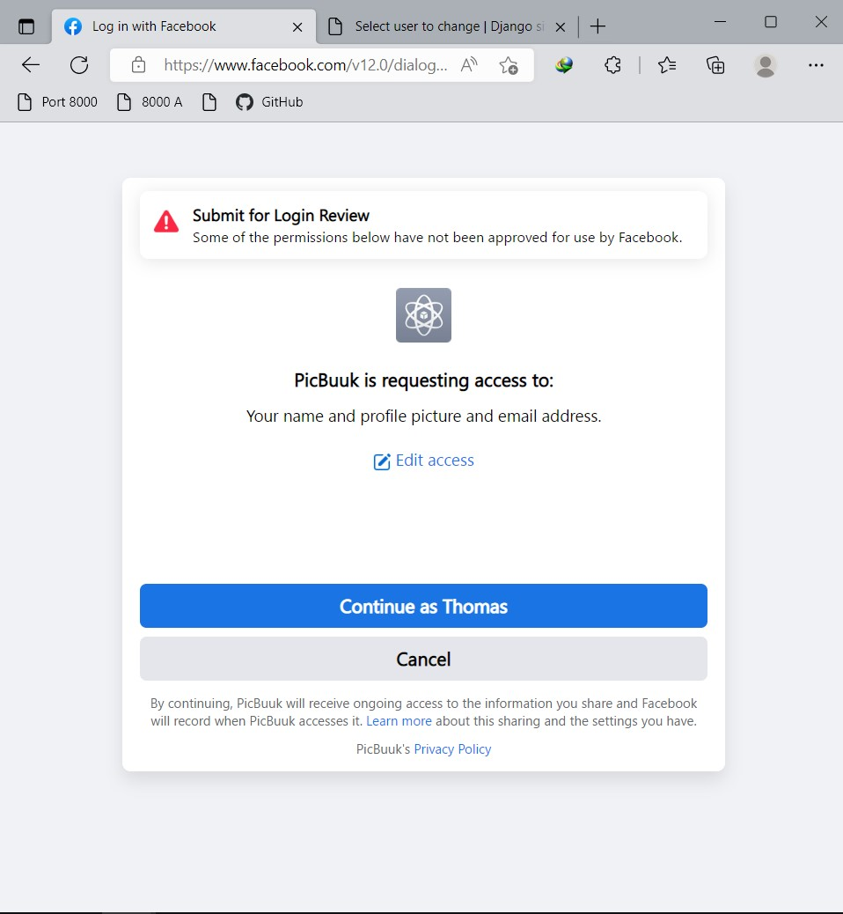

# Django Social App
 Django Social Media App for Image Bookmarking (PicBook)  
 

 The packages used are found in the ```requirements.txt``` file.

## The app has the following functionalities
- Authentication using the Django authentication framework
- Extended user model with a custom profile model
- A custom authentication backend that allows users to sign in with either username or email
- Social authentication (OAuth2) with Facebook and Google 
- Image thumbnails
- A JavaScript bookmarklet with JavaScript and Django
- Infinite scroll pagination
- A user follow system
- An activity feed
- Use of Django signals to create actions for display on activity feed
<!-- - Count image views with Redis -->
<!-- - Build an image ranking with Redis -->

## Social Authentication Screenshots
### Login Page with Social Authentication


### Google Authentication Page


### Facebook Authentication Page


---

```python
print('🎉🎉🎉🎉🎉🎉')
while True:
    if os.path.isfile('manage.py'):
        shell.run(
            "python manage.py runserver"
        )
```
## Author

LinkedIn - [Thomas Burns Botchwey](www.linkedin.com/in/tbbotchwey)

## Credit

[Antonio Melé](https://antoniomele.es/)  
[Django 4 by Example](https://djangobyexample.com/)